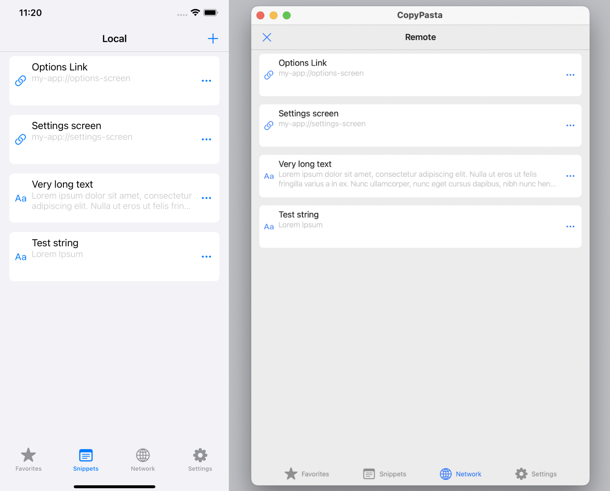

  <h1 align="center">Links for iOS and macOS</h1>

  

## Description

Links is a cross-platfrom application that allows QA engineers and developers to handle DeepLink/UniversalLink content over all their bunch of devices and simulators easily.

- Convinient editor
- Stream your link snippets to other devices in your local network.

## Mission

I want to create a simple solution for resolving daily testing routines.

## Architecture

The application is modular and implementened using [TCA](https://github.com/pointfreeco/swift-composable-architecture) architecture.
UI is build using SwiftUI and UIKit.